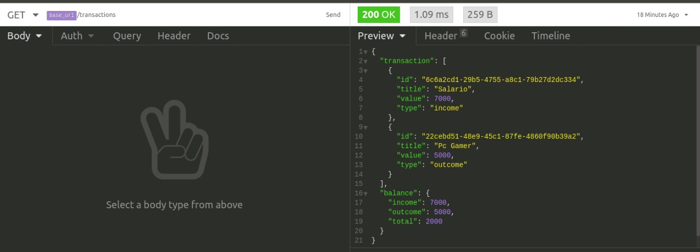

<!-- # bootcamp-gostack-desafios -->

<h3 align="center">  Desafio 5 - Fundamentos NodeJs </h3>

### Sobre o desafio

Aplicação para cadastrar e listar despesas e lucros de uma api.

- POST /transactions: A rota deve receber title, value e type dentro do corpo da requisição, sendo type o tipo da transação, que deve ser income para entradas (depósitos) e outcome para saidas (retiradas):

- GET /transactions: Essa rota deve retornar uma listagem com todas as transações que você cadastrou até agora, junto com o valor de soma de entradas, retiradas e total de crédito. Essa rota deve retornar um objeto com o formato a seguir:

### Objeto (insomnia)

- Listando despesas e lucros : Usando repositorio para simular o ambiente de banco de dados
- Cadastrando despesas e lucros : Usando repositorio para simular o ambiente de banco de dados

---

> Fundamentos do foguete.
